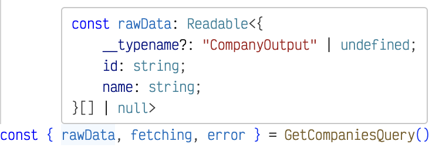

# Svelte x Apollo x Urql - GrapqhQL Codegen Plugin



[GraphQL Code Generator](https://www.graphql-code-generator.com) plugin to use Apollo or Urql in Svelte with full Typescript support

## Motivation

Inspired by [ticruz38's work](https://github.com/ticruz38/graphql-codegen-svelte-apollo). Since ticruz38 didn't seem to update his repo anymore, I decieded to continue his work by creating this repo. And also added support for Urql queries.

## Note

`graphql-codegen-svelte-apollo` is a plugin for [graphql-code-generator](https://graphql-code-generator.com) ecosystem, please refer to their [website](https://graphql-code-generator.com) for documentation relative to the configuration in codegen.yml

## Installation

Ensure that your project contains all needed dependencies for this plugin

```shell
npm i -S graphql

npm i -D @graphql-codegen/cli
npm i -D @graphql-codegen/typescript
npm i -D @graphql-codegen/typescript-operations
npm i -D @nerd-coder/graphql-codegen-svelte-queries
```

## API Reference

### `clientPath`

- type: `string`
- required: true

Path to the apollo or urql client for this project (should point to a file with an the client as default export)

```yml
generates:
path/to/file.ts:
  plugins:
    - typescript
    - typescript-operations
    - graphql-codegen-svelte-apollo
  config:
    clientPath: PATH_TO_APOLLO_CLIENT
    clientType: apollo
```

### `clientType`

- type: `'apollo' | 'urql'`
- required: true

Client type to generate

```yml
generates:
path/to/file.ts:
  plugins:
    - typescript
    - typescript-operations
    - graphql-codegen-svelte-apollo
  config:
    clientPath: PATH_TO_APOLLO_CLIENT
    clientType: apollo
```

### `asyncQuery`

- type: `boolean`
- default: `false`

By default, the plugin only generate observable queries, sometimes it may be useful to generate promise-based queries

```yml
generates:
path/to/file.ts:
  plugins:
    - typescript
    - typescript-operations
    - @nerd-coder/graphql-codegen-svelte-queries
  config:
    clientPath: PATH_TO_APOLLO_CLIENT
    clientType: apollo
    asyncQuery: true
```

### `importFrom`

- type: `string`
- default: `''`

When provided, import types from the generated typescript types file path. if not given, omit import statement.

I you're not using this config, it's recommended to also specify those additional config options for lean code generation:

- `noExport: true`
- `onlyOperationTypes: true`

_(Those config abolve are belong to `TypeScriptDocumentsPluginConfig` type in `@graphql-codegen/typescript-operations` package)_

## Usage Example

### With Observable queries

For the given input:

```graphql
fragment TransactionFragment on TransactionDescription {
  contractAddress
  from
  gasUsed
  gasPrice
  input
  isError
  to
  value
}

query Transactions($address: String) {
  transactions(address: $address) {
    ...TransactionFragment
  }
}
```

And the following configuration:

```yaml
schema: YOUR_SCHEMA_HERE
documents: './src/**/*.graphql'
generates:
path/to/file.ts:
  plugins:
    - typescript
    - typescript-operations
    - @nerd-coder/graphql-codegen-svelte-queries
  config:
    clientPath: PATH_TO_APOLLO_CLIENT
    clientType: apollo
```

Codegen will pre-compile the GraphQL operation into a `DocumentNode` object, and generate a ready-to-use Apollo query for each operation you have.

In you application code, you can import it from the generated file, and use the query in your component code:

```svelte
<script lang="ts">
  import { Transactions } from 'codegen'

  var address = '0x0000000000000000000000000000'
  $: ({ rawData, loading, errorMessages } = Transactions({ address }))
</script>

{#if $loading}
  <p>Loading ...</p>
{:else if $errorMessages.length}
  <p>{$errorMessages.join()}</p>
{:else}
  <ul>
    {#each $rawData || [] as transaction}
      <li>Sent transaction from {transaction.from} to {transaction.to}</li>
    {:else}
      <li>No data available!</li>
    {/each}
  </ul>
{/if}
```

Each time you change the address, the query will re-fetch and show the new results in the template.

### With Async Queries

Sometimes, you may need/prefer to have an async query (only available with asyncQuery option set to true)

For the given input:

```graphql
fragment TransactionFragment on TransactionDescription {
  contractAddress
  from
  gasUsed
  gasPrice
  input
  isError
  to
  value
}

query Transactions($address: String) {
  transactions(address: $address) {
    ...TransactionFragment
  }
}
```

And the following configuration:

```yaml
schema: YOUR_SCHEMA_HERE
documents: './src/**/*.graphql'
generates:
path/to/file.ts:
  plugins:
    - typescript
    - typescript-operations
    - graphql-codegen-svelte-apollo
  config:
    clientPath: PATH_TO_APOLLO_CLIENT
    clientType: apollo
    asyncQuery: true
```

Codegen will pre-compile the GraphQL operation into a `DocumentNode` object, and generate a ready-to-use Apollo query for each operation you have.

In you application code, you can import it from the generated file, and use the query in your component code:

```html
<script lang="ts">
  import { AsyncTransactions } from 'codegen'

  var address = '0x0000000000000000000000000000'
</script>

<ul>
  {#await AsyncTransactions({ address })} Loading... {:then transactions} {#each transactions || []
  as transaction}
  <li>Sent transaction from {transaction.from} to {transaction.to}</li>
  {/each} {/await}
</ul>
```

## TODO

- Add more example
